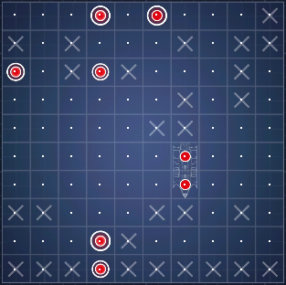
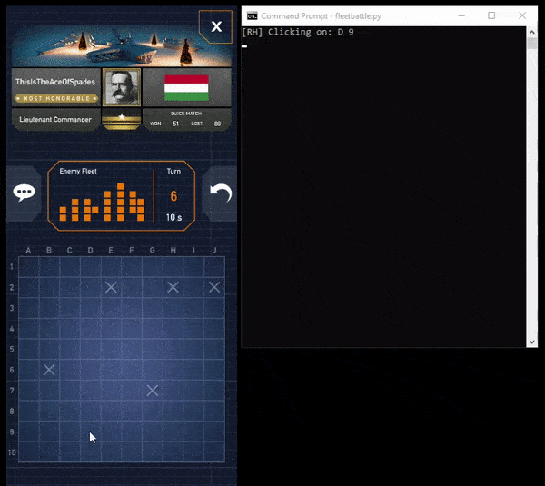

# FleetBattleAI
An AI for the popular mobile game Fleet Battle through machine vision and image analysis using Python.

## Description:

The program takes a screenshot and begins to check the content of each square (whether empty, hit, or missed) via a color-matching algorithm. Coordinates of the main square and the relative separation distances are defined by the user. The AI then begins on clicking on the coordinates of a random square until it hits a ship. Once it finds a hit square, it will check the surrounding squares until the entire vessel is destroyed.

## Prerequisites:
* Windows
* Android Device (adb access via USB)
* scrcpy (https://github.com/Genymobile/scrcpy)

## Demo:

